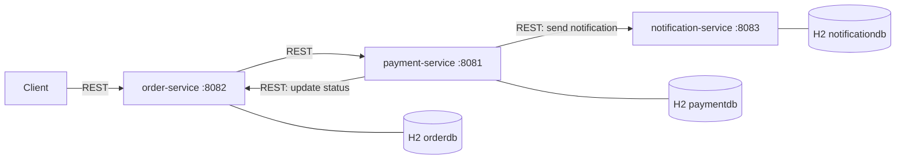

# Order Payment Notification Service

A Spring Boot microservice backend test made up of three independent services. Each service has its own database and communicates with the others over REST.

## Architecture



### Services

| Service | Port | Context Path | Database | Responsibility |
|---------|------|--------------|----------|----------------|
| `order-service` | 8082 | `/order-service` | H2 in-memory `orderdb` | Creates and manages orders, calls payment-service |
| `payment-service` | 8081 | `/payment-service` | H2 in-memory `paymentdb` | Processes payments, updates orders, and triggers notifications |
| `notification-service` | 8083 | `/notification-service` | H2 in-memory `notificationdb` | Sends notifications, processed asynchronously |

### Inter-service communication

| From | To | Configuration |
|------|----|---------------|
| `order-service` | `payment-service` | `payment.service.url=http://localhost:8081/payment-service` |
| `payment-service` | `order-service` | `order.service.url=http://localhost:8082/order-service` |
| `payment-service` | `notification-service` | `notification.service.url=http://localhost:8083/notification-service` |

`notification-service` does not call any other service and does not depend on any of them, so a failure there does not directly break the order and payment flow.

### Design decisions

- **Database per service**: each service owns its schema (`ddl-auto: update`), with no cross-service database access.
- **Synchronous communication over REST**: service addresses are set through `*.service.url` properties, so they are easy to change per environment.
- **Asynchronous notifications**: `notification-service` uses its own thread pool (core 2, max 5, queue 100) so sending notifications does not block requests.
- **In-memory H2**: chosen so the project runs without any database setup. Data is lost when a service restarts.

## Running

Start all three services (any order, each in its own terminal):

```bash
cd notification-service && ./mvnw spring-boot:run
cd payment-service && ./mvnw spring-boot:run
cd order-service && ./mvnw spring-boot:run
```

| Service | Base URL | H2 Console |
|---------|----------|------------|
| order | http://localhost:8082/order-service | http://localhost:8082/order-service/h2-console |
| payment | http://localhost:8081/payment-service | http://localhost:8081/payment-service/h2-console |
| notification | http://localhost:8083/notification-service | http://localhost:8083/notification-service/h2-console |

H2 JDBC URL: `jdbc:h2:mem:<orderdb|paymentdb|notificationdb>`, user `sa`, empty password.
